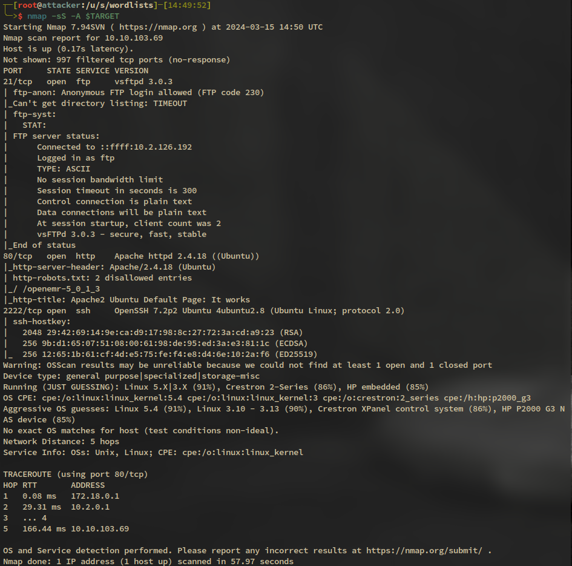
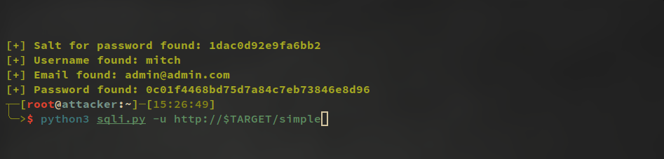
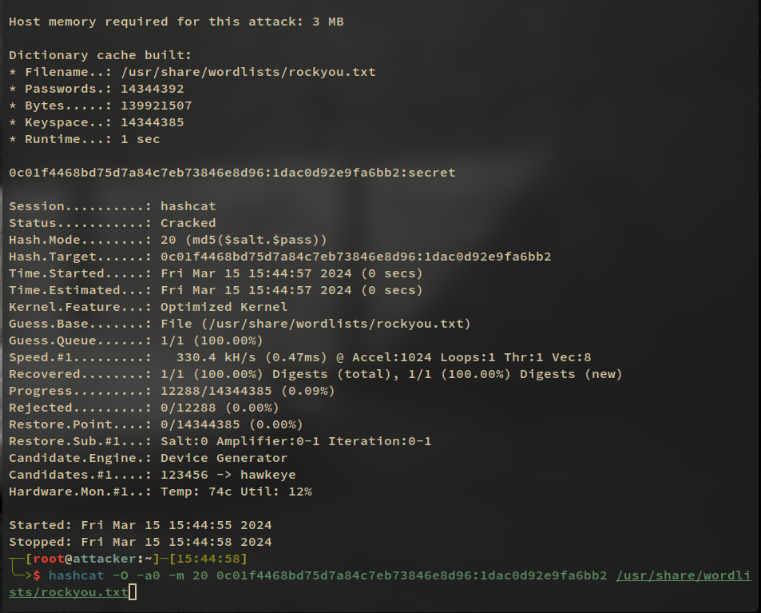

# Process

- nmap to identify ports and services
  
- attempt ftp backdoor but server is running in anonymous mode
- gobuster for http directory enumeration
  - identify /simple dir
  - navigate to webpage in firefox
  - identify cms made simple start page
  - use exploitdb to find vulnerability
  - copy and fix python code
    
- use hashcat to crack password with salt that was obtained in previous step
  
  - now we have user: mitch and password: secret
  - we can use ssh to login to the machine
  - might need to restart machine
  - ls to find user flag and other users with ls /home
  - check for sudo privileges with sudo -l
  - run vim as root with sudo and navigate to /root directory to access root flag
